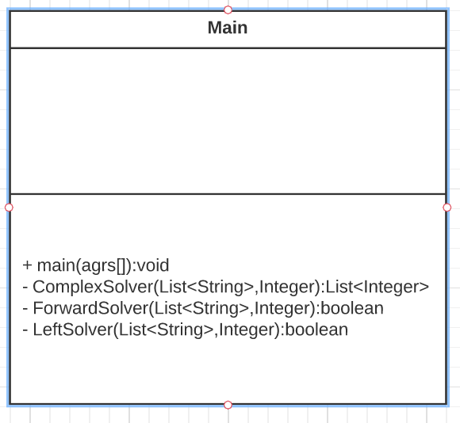

# Decisions concerning traffic rules:

I couldn't find information about multiple ambulances in a cross intersection,
so I decided that the order of the ambulances shall be the same as the order of
the input(top, right,bottom,left)

If no car has priority over the others(for example when 4 cars want to go straight)
then I use the same rule as with the ambulances, so they shall go in the order of the
input(top,right,bottom,left)

# Implementation: 

I didn't create multiple classes since it did not seem necessary for a task of this size
but if this task would be a part of a bigger software/project I would have
created multiple components to make it easier to expand.

I used a Main class 
in which the main function is used to digest the incoming information and 
pass it onto the ComplexSolver function. I also deal with the ambulance here as it is
a simple task, and it makes the job of the ComplexSolver easier.

The ComplexSolver iterates through all the cars given to it as arguments and
uses the ForwardSolver function for
deciding if a car can go forward and the LeftSolver for deciding if it can go left.
RightSolver would only be needed if the ambulance was present, but I deal with the
ambulances beforehand in the main function. The ComplexSolver returns with a 
list containing numbers. These numbers are the sequence of the cars and are decoded
into the output in the main function. The ForwardSolver and LeftSolver functions 
return with a boolean( true if the car can go false if not).

The Class Diagram of main is below: (there aren't any attributes since these are in the main function
where they are created from the input).

# Tests

There are 6 tests currently for my application in the
MainTest class. Here I tried to test most of the unusual
scenarios such as: 4 cars going straight, only 1 car coming
to the intersection, ambulances and also added some
complex tests from online practicing sites that I found. 

